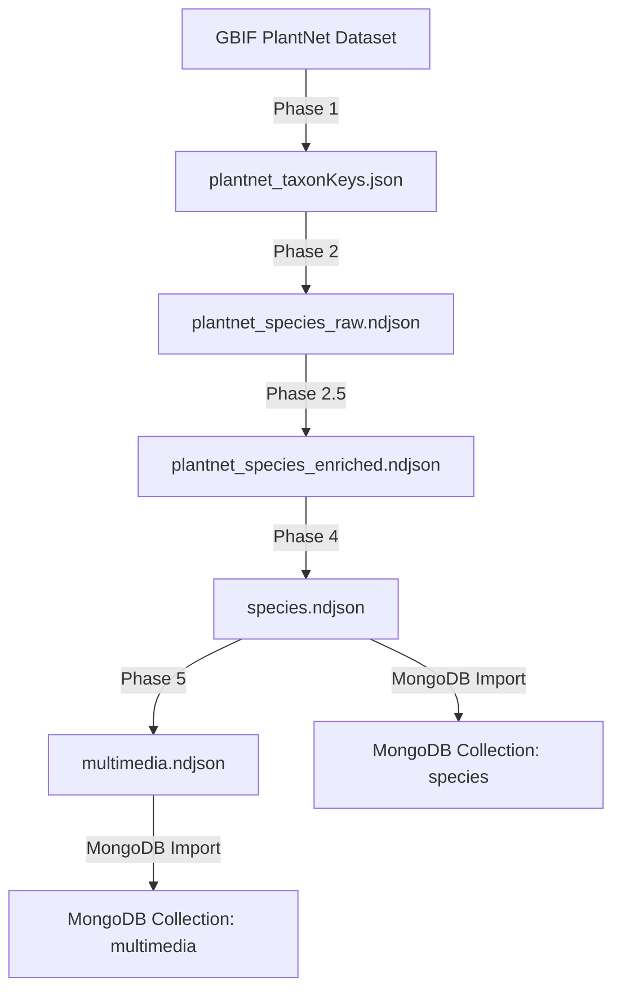

# My-Plants Database

Dieses Repository bündelt und verwaltet die Pflanzendaten für die **My-Plants Lern-App**. Es enthält Scripts zur Datenbeschaffung von GBIF (Global Biodiversity Information Facility) und zur Aufbereitung in ein MongoDB-kompatibles Format.

## 📋 Übersicht

**Zweck:** Bereitstellung von strukturierten Pflanzendaten (botanische Namen, deutsche Namen, Bilder mit Organ-Tags) für die My-Plants App.

**Datenquelle:** GBIF API, primär das [PlantNet observations Dataset](https://www.gbif.org/dataset/7a3679ef-5582-4aaa-81f0-8c2545cafc81)

**Output-Formate:** NDJSON (Newline Delimited JSON) – optimal für MongoDB-Import und Streaming-Verarbeitung

## 🎯 Inhalt der Datenbank

### species.ndjson (generiert, nicht im Git)
- **18.673 Pflanzenarten** roh, davon **~5.500 mit deutschem Namen** (nur die landen im Output)
- Felder: `taxonKey`, `scientificName`, `canonicalName`, `germanName`, `familyKey`, `family`, `germanFamilyName`

### multimedia.ndjson (generiert, nicht im Git)
- **3.166.029 Bild-URLs** mit Organ-Tags
- Felder: `taxonKey`, `species`, `organ` (leaf/flower/fruit/bark/habit/other), `occurrenceId`, `url`, `creator`, `license`, `wilsonScore`
- Alle URLs nutzen die [GBIF Image API](https://techdocs.gbif.org/en/openapi/images) (unbegrenzter Cache)

### data/exam-lists/ (kuratiert, im Git)
- Prüfungslisten je Beruf, aktuell **Garten- und Landschaftsbau (AuGaLa)**: Gesamtliste (205) + Kurse 01/07/12
- `catalog.json` beschreibt Bundesländer, Domänen, Berufe und Listen; die Listen selbst sind NDJSON
  mit `taxonKey`, `canonicalName`, `germanName`

### data/ecology/ (Fremddatensatz + Backup, im Git)
- **EIVE 1.0** – ökologische Zeigerwerte für Europa (Licht, Wärme, Feuchte, Boden-pH, Stickstoff),
  CC BY 4.0. Abgeleitet: `eive-slim.json` mit **10.693 Arten**
- `backup-ecology-prod-2026-08-02.ndjson` – Sicherung der alten `ecology`-Collection aus Prod
  (Tichý/Ellenberg-Werte, 3.363 Pflanzen), Stand vor dem Umstieg auf EIVE
- Details und alle Messwerte: [data/ecology/eive-1.0/references/ANALYSE.md](data/ecology/eive-1.0/references/ANALYSE.md)

## 🚀 Quick Start

### Voraussetzungen
- **Node.js** ≥ 18 (für native `fetch` API)
- **npm** oder **yarn**

### Installation

```bash
# Repository klonen
git clone <repository-url>
cd my-plants_database

# Dependencies installieren
npm install
```

### Daten generieren (komplette Pipeline)

```bash
# Phase 1: TaxonKeys sammeln
npm run fetch-keys

# Phase 2: Species-Daten anreichern (GBIF)
npm run enrich-species

# Phase 2.5: Wikidata-Ergänzung (NEU)
npm run enrich-wikidata

# Phase 4: Filtern und bereinigen
npm run filter-species

# Phase 5: Multimedia sammeln
npm run collect-multimedia

# Phase 5b: Falls bei Phase 5 Fehler auftreten (429 Rate Limit)
npm run retry-multimedia

# ODER: Alle Phasen nacheinander
npm run build-all
```

### Prüfungslisten bauen und prüfen

```bash
# Erzeugt data/exam-lists/**/ *.ndjson aus data/reference/galabau_pflanzen.json
npm run build-exam-lists

# Prüft catalog.json, NDJSON-Format und taxonKey-Abdeckung
npm run validate-exam-lists
```

> Beide Befehle brauchen eine vorhandene `data/output/species.ndjson` (taxonKey-Lookup).

### Dauer-Schätzung
- **Phase 1:** ~3-5 Minuten (je nach API-Geschwindigkeit)
- **Phase 2:** ~4-6 Stunden (für ~18k taxonKeys bei Concurrency=10)
- **Phase 2.5:** ~2-4 Stunden (Wikidata-Ergänzung, nur für Species ohne deutsche Namen)
- **Phase 4:** ~10-30 Sekunden (Filterung)
- **Phase 5:** ~6-12 Stunden (für ~18k Species mit Bildern)

> **Tipp:** Phase 2, 2.5 und 5 können unterbrochen und fortgesetzt werden (siehe [docs/PROZESS.md](docs/PROZESS.md))

## 📂 Verzeichnisstruktur

```
myplants-database/
├── README.md                           # Diese Datei
├── docs/
│   ├── PROZESS.md                      # Detaillierte Prozessdokumentation
│   ├── DATENSTRUKTUR.md                # Schema & MongoDB-Integration
│   ├── API_REFERENZ.md                 # GBIF & Wikidata API Details
│   └── plans/                          # Konzepte für spätere Ausbaustufen
├── scripts/
│   ├── 01_fetch_taxonkeys.js           # Phase 1
│   ├── 02_enrich_species.js            # Phase 2 (GBIF)
│   ├── 03_enrich_wikidata.js           # Phase 2.5 (Wikidata)
│   ├── 04_filter_species.js            # Phase 4
│   ├── 05_collect_multimedia.js        # Phase 5
│   ├── 05b_retry_multimedia.js         # Phase 5b: Fehlgeschlagene Keys nachladen
│   ├── build-exam-lists.js             # Prüfungslisten aus Referenzdaten bauen
│   ├── validate-exam-lists.js          # Prüfungslisten validieren
│   ├── checks/                         # Einmalige Abdeckungs-Checks (GaLaBau)
│   ├── tests/                          # Test-Versionen (nur 50 Plants)
│   └── utils/
│       ├── gbif-helpers.js             # GBIF API Funktionen
│       ├── wikidata-helpers.js         # Wikidata SPARQL Funktionen
│       └── filter-helpers.js           # Filter-Utilities
├── data/
│   ├── output/                         # Finale Daten (gitignored, weil zu groß)
│   │   ├── species.ndjson
│   │   └── multimedia.ndjson
│   ├── intermediate/                   # Zwischenschritte (gitignored)
│   │   ├── plantnet_taxonKeys.json
│   │   ├── plantnet_species_raw.ndjson
│   │   ├── plantnet_species_enriched.ndjson
│   │   └── failed_multimedia_keys.txt  # Fehlgeschlagene Keys aus Phase 5
│   ├── reference/                      # Quelllisten (AuGaLa-Sortiment)
│   ├── exam-lists/                     # Kuratierte Prüfungslisten + catalog.json
│   └── ecology/                        # EIVE 1.0 + Backup der alten ecology-Collection
├── tools/                              # GBIF-Bildbrowser (HTML), Hilfsdateien
├── archive/                            # Historische ChatGPT-Verläufe
└── package.json
```

## 🔄 Workflow-Übersicht



### Phase-Details

1. **Phase 1: TaxonKeys sammeln**
   - Sammelt alle eindeutigen `taxonKey` aus dem PlantNet-Dataset via GBIF Faceting
   - Output: ~18k taxonKeys
   - Dauer: ~3-5 Min

2. **Phase 2: Species anreichern (GBIF)**
   - Ruft für jeden `taxonKey` taxonomische Daten von GBIF ab
   - Normalisiert Synonyme → akzeptierte Namen
   - Sammelt deutsche Trivialnamen (preferred oder kürzester Name)
   - Output: Alle Species mit vollständigen Metadaten
   - Dauer: ~4-6 Std

3. **Phase 2.5: Wikidata-Ergänzung** ⭐ NEU
   - Ergänzt fehlende deutsche Namen aus Wikidata SPARQL API
   - Nur für Species OHNE deutsche Namen aus GBIF
   - Output: Angereicherte Species mit mehr deutschen Namen
   - Dauer: ~2-4 Std (abhängig von Anzahl fehlender Namen)

4. **Phase 4: Filtern & Bereinigen**
   - Nur `rank: "SPECIES"` + `status: "ACCEPTED"`
   - Nur mit deutschen Namen
   - Vereinfacht auf 7 Felder (taxonKey, scientificName, canonicalName, germanName,
     familyKey, family, germanFamilyName)
   - Output: Bereinigte `species.ndjson`
   - Dauer: ~10-30 Sek

5. **Phase 5: Multimedia sammeln**
   - Sammelt Bilder für jede Species aus GBIF Occurrences
   - Extrahiert Organ-Tags (leaf, flower, etc.)
   - Nutzt GBIF Image API (unbegrenzter Cache)
   - Bei Fehlern: Keys werden in `failed_multimedia_keys.txt` gespeichert
   - Output: `multimedia.ndjson`
   - Dauer: ~6-12 Std

6. **Phase 5b: Retry fehlgeschlagene Keys** (optional)
   - Lädt fehlgeschlagene Keys aus Phase 5 nach
   - Niedrigere Concurrency und längere Pausen
   - Hängt Bilder an `multimedia.ndjson` an
   - Befehl: `npm run retry-multimedia`

## 🖼️ Bild-URLs in der App verwenden

Die `multimedia.ndjson` enthält Basis-URLs der GBIF Image API **ohne Größenangabe**.
Das ermöglicht dynamische Bildgrößen je nach Anwendungsfall.

### URL-Format

**Basis-URL (in Datenbank):**
```
https://api.gbif.org/v1/image/cache/occurrence/{occurrenceId}/media/{md5}
```

**Mit Größe (in App generieren):**
```
https://api.gbif.org/v1/image/cache/{width}x/occurrence/{occurrenceId}/media/{md5}
```

### Beispiel-Code (JavaScript/TypeScript)

```javascript
// Basis-URL aus Datenbank
const baseUrl = record.url;

// Helper-Funktion für Größenanpassung
function getImageUrl(baseUrl, width) {
  if (!width) return baseUrl;
  return baseUrl.replace('/occurrence/', `/${width}x/occurrence/`);
}

// Verwendung
const thumbnail = getImageUrl(baseUrl, 200);   // 200px für Listen
const detail = getImageUrl(baseUrl, 600);      // 600px für Details
const fullsize = getImageUrl(baseUrl, 1200);   // 1200px (Maximum)
const original = baseUrl;                       // Ohne Resize
```

### Empfohlene Größen

| Kontext | Breite | Beispiel |
|---------|--------|----------|
| Listen/Grid | `200x` | Thumbnail-Ansicht |
| Kartenansicht | `400x` | Mittlere Vorschau |
| Detailseite | `600x` oder `800x` | Gute Qualität |
| Vollbild/Zoom | `1200x` | Maximum (API-Limit) |

### Hinweise

- **Lazy Loading:** Bilder erst laden wenn sichtbar (`loading="lazy"`)
- **Caching:** GBIF cached Bilder **unbegrenzt** – einmal geladen = dauerhaft verfügbar
- **Rate Limit:** Normale App-Nutzung ist kein Problem (verteilt über viele Nutzer)
- **Lizenzen:** Beachte das `license`-Feld pro Bild!

## 📊 MongoDB Import

```bash
# Species importieren
mongoimport --uri "mongodb://localhost:27017" \
  --db myflora \
  --collection species \
  --file data/output/species.ndjson

# Multimedia importieren
mongoimport --uri "mongodb://localhost:27017" \
  --db myflora \
  --collection multimedia \
  --file data/output/multimedia.ndjson

# Indexes erstellen (empfohlen)
mongosh --eval '
  use myflora;
  db.species.createIndex({ taxonKey: 1 }, { unique: true });
  db.species.createIndex({ "canonicalName": 1 });
  db.species.createIndex({ "germanName": 1 });
  db.multimedia.createIndex({ taxonKey: 1 });
  db.multimedia.createIndex({ organ: 1 });
'
```

Mehr Details: [docs/DATENSTRUKTUR.md](docs/DATENSTRUKTUR.md)

## 🛠 Konfiguration

Alle Scripts verwenden Konfigurationsobjekte am Anfang der Datei:

```javascript
const CONFIG = {
  DATASET_KEY: '7a3679ef-5582-4aaa-81f0-8c2545cafc81', // PlantNet
  CONCURRENCY: 10,  // Parallele API-Requests
  // ...
};
```

Anpassbare Parameter:
- `CONCURRENCY`: Anzahl paralleler Requests (höher = schneller, aber mehr Last auf GBIF API)
- `PAGE_SIZE`: Anzahl Ergebnisse pro API-Request
- Output-Pfade

## ⚠️ Wichtige Hinweise

### GBIF API Rate Limits
- Die Scripts implementieren automatisches **Retry mit Exponential Backoff** bei 429/5xx Fehlern
- Bei sehr hoher Concurrency kann es zu temporären Timeouts kommen
- **Empfohlen:** `CONCURRENCY: 6-10` für stabile Performance

### Daten-Updates
- GBIF Backbone wird regelmäßig aktualisiert (neue Taxa, geänderte Namen)
- **Empfehlung:** Alle 3-6 Monate Daten neu generieren
- Siehe [docs/PROZESS.md](docs/PROZESS.md) für Delta-Updates

### Lizenzen
- **Daten:** GBIF-Daten unterliegen verschiedenen Lizenzen (siehe `license`-Feld in `multimedia.ndjson`)
- **PlantNet:** Meist CC-BY oder CC-BY-SA
- **Bilder:** Beachte die individuellen Lizenzen pro Bild!

## 📚 Dokumentation

- **[PROZESS.md](docs/PROZESS.md)** – Detaillierte Prozessbeschreibung, API-Calls, Fehlerbehandlung
- **[DATENSTRUKTUR.md](docs/DATENSTRUKTUR.md)** – Schema-Details, MongoDB-Integration, Query-Beispiele
- **[API_REFERENZ.md](docs/API_REFERENZ.md)** – GBIF API Endpoints, Best Practices, Limits
- **[ecology/eive-1.0/references/ANALYSE.md](data/ecology/eive-1.0/references/ANALYSE.md)** – EIVE 1.0:
  Struktur, semantische Prüfung, Abdeckung, Zonenregel (alle Zahlen gemessen)

## 🤝 Beitragen

Für Änderungen und Erweiterungen:
1. Branch erstellen: `git checkout -b feature/meine-aenderung`
2. Scripts testen mit Subset der Daten (z.B. nur 100 taxonKeys)
3. Dokumentation aktualisieren
4. Pull Request erstellen

## 📝 Changelog

### August 2026
- 🗑️ **Hints-Pipeline entfernt** (Scripts, Daten, Review-UI, Doku). Die Lern-Hints werden nicht
  umgesetzt — die App baut den entsprechenden Quiztyp stattdessen auf den ökologischen
  Zeigerwerten (EIVE) auf.
- 📦 EIVE 1.0 (`data/ecology/`) inkl. Analysebericht und Backup der alten `ecology`-Collection

### Februar 2026
- 📋 Prüfungslisten-Architektur (`data/exam-lists/` + `catalog.json`), erster Datensatz GaLaBau

### v1.0.0 (September 2025)
- ✨ Initiale Refaktorisierung aus Chat-basierten Scripts
- 📦 Modularisierung in 4 klare Phasen
- 📖 Vollständige Dokumentation
- 🧰 Wiederverwendbare Utility-Module
- 🚀 npm Scripts für einfache Ausführung


---

**Hinweis:** Dieses Repository dient ausschließlich der Datenvorbereitung für die My-Plants App. Die finalen Daten werden in MongoDB gehostet und von der App konsumiert.
